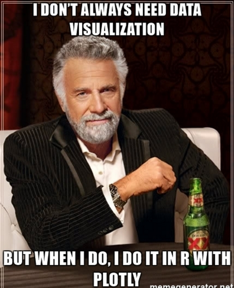

```{r setup, include=FALSE}
knitr::opts_chunk$set(echo = FALSE)
library(plotly)
library(Quandl)
library(reshape2)
library(dplyr)
library(forecast)
library(gapminder)

set.seed(100)
d <- diamonds[sample(nrow(diamonds), 1000), ]
```


## Highlights

- Data Visualization in R
- Plotly Overview
- Forecasting US Vehicle Sales Example 
- Plotly with Shiny Example  


## Introduction

- Data scientist at EY
- Focus mainly on time series and predictive analysis 
- Use plotly on a daily basis
- Work with R around 4 years
- Developing shiny based package for ML and forecasting applications
- M.S in Actuarial Mathematics and M.A Applied Economics  
- rami.krispin@gmail.com
- github.com/RamiKrispin

## Quick Poll

How many are familiar with:

- Plotly
- ggplot2
- %>%


## Data Visualization

Data visualization is the art of exploring and explaining data using different graphical formats including interactive charts, statistical graphs, explanatory plots, etc. It can be divided into two main categories:

 - Exploratory - the use of data visualization to explore the data for patterns, outliers and insights, in order to define hypothesis tests, research questions and to choose the appropriate models to apply.
 
 - Explanatory - “story-telling” using data, in an efficient and concise manner.

## Key Data Visualization Packages in R 

```{r, echo=FALSE, fig.width=14, message=FALSE, warning=FALSE}
df1 <- data.frame(package = c("ggplot2", "plotly", "dygraphs", 
                              "HIGHCHARTER", "rbokeh"),
                  download = c(51269, 27126, 4080, 1864, 696))

df1$package <- factor(df1$package, levels = c("ggplot2", "plotly", "dygraphs", 
                                                 "HIGHCHARTER", "rbokeh"))
plot_ly(data = df1, x = ~package, y = ~ download, 
        mode = "bar", 
        color = ~ package) %>%
  layout(title = "Monthly Downloads from CRAN",
         xaxis = list(title = "Package"),
         yaxis = list(title = "Monthly Download"))

```

## Motivation




## Motivation

R base plot

```{r, echo=TRUE, message=FALSE, warning=FALSE,fig.height=5, fig.width=14}
plot(d$carat, d$price)
```

## Motivation

With plotly

```{r, echo=TRUE, message=FALSE, warning=FALSE,fig.height=5, fig.width=14}
plot_ly(x = d$carat, y = d$price)
```


## Motivation

And with some additional effort

```{r, echo=TRUE,fig.height=5, fig.width=14, message=FALSE, warning=FALSE}
plot_ly(d, x = ~carat, y = ~price, color = ~carat, name = "Diamonds Price", size = ~carat, text = ~paste("Clarity: ", clarity)) %>% 
  layout(title = "Diamonds Dataset - Price vs Carat", xaxis = list(title = "Carat"), yaxis = list(title = "Price"))
```

## Motivation

Use the lasso option on the map!!!

```{r, echo=FALSE, message=FALSE, warning=FALSE}
library(crosstalk)
eqs <- SharedData$new(quakes)

# you need a mapbox API key to use plot_mapbox()
# https://www.mapbox.com/signup/?route-to=https://www.mapbox.com/studio/account/tokens/
map <- plot_mapbox(eqs, x = ~long, y = ~lat) %>%
  add_markers(color = ~depth) %>%
  layout(
    mapbox = list(
      zoom = 2,
      center = list(lon = ~mean(long), lat = ~mean(lat))
    )
  ) %>%
  highlight("plotly_selected")

# shared properties of the two histograms
hist_base <- plot_ly(eqs, color = I("black"), histnorm = "probability density") %>%
  layout(barmode = "overlay", showlegend = FALSE) %>%
  highlight(selected = attrs_selected(opacity = 0.5))

histograms <- subplot(
  add_histogram(hist_base, x = ~mag),
  add_histogram(hist_base, x = ~stations),
  nrows = 2, titleX = TRUE
)

bscols(histograms, map)

p <- plot_ly(economics, x = ~pce, y = ~psavert, z = ~unemploy, color = ~as.numeric(date), mode = "markers+lines")
plotly_json(p)
```

## Motivation

Linked animated views

```{r, echo=FALSE, message=FALSE, warning=FALSE}
data(gapminder, package = "gapminder")
countryByArea <- read.table(
  "https://bit.ly/2h6vscu",
  header = TRUE, stringsAsFactors = FALSE
)

gap <- gapminder %>%
  dplyr::left_join(countryByArea, by = "country") %>%
  transform(popDen = pop / area) %>%
  transform(country = forcats::fct_reorder(country, popDen))

gapKey <- crosstalk::SharedData$new(gap, ~country)

p1 <- plot_ly(gap, y = ~country, x = ~popDen, hoverinfo = "x") %>%
  add_markers(alpha = 0.1, color = I("black")) %>%
  add_markers(data = gapKey, frame = ~year, ids = ~country, color = I("red")) %>%
  layout(xaxis = list(type = "log"))

p2 <- plot_ly(gap, x = ~gdpPercap, y = ~lifeExp, size = ~popDen, 
              text = ~country, hoverinfo = "text") %>%
  add_markers(color = I("black"), alpha = 0.1) %>%
  add_markers(data = gapKey, frame = ~year, ids = ~country, color = I("red")) %>%
  layout(xaxis = list(type = "log"))

subplot(p1, p2, nrows = 1, widths = c(0.3, 0.7), titleX = TRUE) %>%
  hide_legend() %>%
  animation_opts(1000, redraw = FALSE) %>%
  layout(hovermode = "y", margin = list(l = 100)) %>%
  highlight("plotly_selected", color = "blue", opacityDim = 1, hoverinfo = "none")

```


## Motivation

3D Surface Plot

```{r}
plot_ly(z = ~volcano) %>% add_surface()
```


## Plotly - Introduction

- Canadian company, developing tools for data visualization and dashboard applications
- Offering open source packages for interactive data visualization based on D3.js
- API libraries are avilable for R, Python, MATLAB, Julia and others
- Created the Dash - a Python framework for web-based interfaces
- Organizers of the PLOTCON conference 

## Plotly - Introduction

What is so great about plotly:

- Interactive - based on D3.js
- Fairly simple to use 
- Great functionality
- Shiny and R-Markdown
- ggplot2 wraper


What I wish was avilable:

- Cluster analysis 
- Decision tree
- Tree map

## Vehicle Sales Dataset - Demo

Will demo the uses of plotly for exploratory analysis and to communicate the results utilizing key function of the package. 

Data: 

- [US monthly vehicle sales](https://fred.stlouisfed.org/series/TOTALNSA) (collected by the U.S. Bureau of Economic Analysis and sourced from FRED)

- [Civilian unemployment rate](https://fred.stlouisfed.org/series/UNRATENSA) (collected by the U.S. Bureau of Labor Statistics and sourced from FRED)


Key functions:

- Plotting time series data
- Multiple axes
- Seasonal plots
- Lags plot
- Confidence Interval
- Buttons


## Vehicle Sales Dataset - Data Prep

Data prep:

- Source the data from FRED using Quandl
- Arrange the data with dplyr
- Flag observation 


```{r, echo=TRUE, message=FALSE, warning=FALSE}
# Loading the data from FRED
df.sales <- Quandl("FRED/TOTALNSA", type = "raw") #Total Vehicle Sales
df.unemp <- Quandl("FRED/UNRATENSA", type = "raw") #Unemployment Rate
names(df.unemp) <- c("Date", "UnRate")
# Flaging years where the sales droped compared to the previuos year
df <- df.sales %>% arrange(Date) %>% 
  mutate(year = lubridate::year(Date)) 
df.y <- group_by(df,year) %>%  # Calculate the yearly Sales
       summarise(sales.y = sum(Value))
df.y$delta.flag <- ifelse((df.y$sales.y - 
                          c(NA, df.y$sales.y[-nrow(df.y)])) < 0, 
                          1,0 ) 
df.y$delta.flag <- ifelse(is.na(df.y$delta.flag), 0, 
                          df.y$delta.flag) # Modifing NA's 
df1 <- df %>% left_join(df.y) %>% # Merging vehical sales 
              left_join(df.unemp) # and unemployment rate
```

## Vehicle Sales Dataset - Time Series Plot

### Simple time series plot

```{r, echo=TRUE, message=FALSE, warning=FALSE, fig.height=5, fig.width=14, cache = TRUE}
p <- plot_ly(data = df1)%>%
  add_lines(x = ~ Date, y = ~ Value, mode = "line", name = "Vehical Sales")
p
```

## Vehicle Sales Dataset - Time Series Plot

### Add titles: 

```{r, echo=TRUE,message=FALSE, warning=FALSE, fig.height=5, fig.width=14}

p <- plot_ly(data = df1)%>%
  add_lines(x = ~ Date, y = ~ Value, mode = "line", name = "Vehical Sales") %>%
  layout(
    title = "Total Vehicle Sales",
    xaxis = list(title = "Source: U.S. Bureau of Economic Analysis"),
    yaxis = list(title = "Millions of Units"))

```


## Vehicle Sales Dataset - Time Series Plot

```{r Title, echo=FALSE, fig.height=5, fig.width=14, message=FALSE, warning=FALSE}

p <- plot_ly(data = df1)%>%
  add_lines(x = ~ Date, y = ~ Value, mode = "line", name = "Vehical Sales") %>%
  layout(
    title = "Total Vehicle Sales",
    xaxis = list(title = "Source: U.S. Bureau of Economic Analysis"),
    yaxis = list(title = "Millions of Units"))
p

```


## Vehicle Sales Dataset - Shapes

Shapes function:

- Use the shapes function to mark years where the yearly sales decreased with respect to the previous year
- Using loop to add or create new objects in plotly, could save time when we have multiple/reputable processes    


```{r, echo=TRUE}
s <- e <- NULL
s.flag <- 0
e.flag <- 0
rect.list <- NULL
for(i in 2:nrow(df1)){
  if(df1$delta.flag[i] == 1 &  df1$delta.flag[i - 1] == 0){
    s <- df1$Date[i]
    s.flag <- 1 }
  
  if(df1$delta.flag[i] == 0 &  df1$delta.flag[i - 1] == 1){
    e <- df1$Date[i - 1]
    e.flag <- 1}
  
  if(s.flag == 1 & e.flag == 1){
   if(is.null(rect.list)){
     rect.list[[1]] <- list(type = "rect",
            fillcolor = "blue", line = list(color = "blue"), opacity = 0.3,
            x0 = s, x1 = e, xref = "x",
            y0 = 0, y1 = max(df1$Value)*1.05, yref = "y"
       )
   } else {
     rect.list[[length(rect.list) + 1]] <- list(type = "rect",
            fillcolor = "blue", line = list(color = "blue"), opacity = 0.3,
            x0 = s, x1 = e, xref = "x",
            y0 = 0, y1 = max(df1$Value)*1.05, yref = "y")
   }
    s <- e <- NULL
    s.flag <- e.flag <- 0
  }
}
```


## Vehicle Sales Dataset - Shapes


```{r, echo=TRUE, message=FALSE, warning=FALSE}
p <- p %>% layout(shapes = list(
  rect.list[[1]],
  rect.list[[2]],
  rect.list[[3]],
  rect.list[[4]],
  rect.list[[5]],
  rect.list[[6]]))

```


## Vehicle Sales Dataset - Shapes


```{r, echo=FALSE, fig.height=5, fig.width=14, message=FALSE, warning=FALSE}
plot_ly(data = df1)%>%
  add_lines(x = ~ Date, y = ~ Value, mode = "line", name = "Vehical Sales") %>%
  layout(
    title = "Total Vehicle Sales",
    xaxis = list(title = "Source: U.S. Bureau of Economic Analysis"),
    yaxis = list(title = "Millions of Units"),
    shapes = list(
    rect.list[[1]],
    rect.list[[2]],
    rect.list[[3]],
    rect.list[[4]],
    rect.list[[5]],
    rect.list[[6]]))
```

## Vehicle Sales Dataset - Second Axis

Using multiple axis:

-	Adding second Y axis 
-	Useful when we want to plot objects with different scales or measurement units


```{r, echo=TRUE, message=FALSE, warning=FALSE}
p1 <- plot_ly(data = df1)%>%
  add_lines(x = ~ Date, y = ~ Value, mode = "line", name = "Vehical Sales") %>%
  add_trace(x = ~ Date, y = ~UnRate, name = "Unemployment Rate", yaxis = "y2",  
            mode = 'dash', line = list(color = "red")) %>%
  layout(
    title = "Total Vehicle Sales",
    xaxis = list(title = "Source: U.S. Bureau of Economic Analysis"),
    yaxis = list(title = "Millions of Units",
                 range = c(min(df1$Value) * 0.95, max(df1$Value) * 1.05)),# Set the y axis range
    # add rectangle shapes
    shapes = list(
      rect.list[[1]], rect.list[[2]], rect.list[[3]],
      rect.list[[4]], rect.list[[5]], rect.list[[6]]
    ),
    # Defind the second y axis parameters
    yaxis2 = list(
      tickfont = list(color = "red"),
      overlaying = "y",
      side = "right",
      title = "Percentage"
    )
  )

```

## Vehicle Sales Dataset - Second Axis

```{r, echo=FALSE, message=FALSE, warning=FALSE, fig.height=5, fig.width=14}
plot_ly(data = df1)%>%
  add_lines(x = ~ Date, y = ~ Value, mode = "line", name = "Vehical Sales") %>%
  add_trace(x = ~ Date, y = ~UnRate, name = "Unemployment Rate", yaxis = "y2",  
            mode = 'dash', line = list(color = "red")) %>%
  layout(
    title = "Total Vehicle Sales",
    
    xaxis = list(title = "Source: U.S. Bureau of Economic Analysis"),
    yaxis = list(title = "Millions of Units",
                 # Set the y axis range
                 range = c(min(df1$Value) * 0.95, max(df1$Value) * 1.05)
                 ),
    # add rectangle shapes
    shapes = list(
      rect.list[[1]],
      rect.list[[2]],
      rect.list[[3]],
      rect.list[[4]],
      rect.list[[5]],
      rect.list[[6]]
    ),
    # Defind the second y axis parameters
    yaxis2 = list(
      tickfont = list(color = "red"),
      overlaying = "y",
      side = "right",
      title = "Percentage"
    )
    )
```

## Vehicle Sales Dataset - Seasonality Analysis

Prepare the data for time series analysis:

- Subset the data from 2010 – present 

- Transform the data into time series format

- Reshape the data for wide format (by year)


```{r, echo=TRUE, message=FALSE, warning=FALSE}
sales.ts <- window(ts(df1$Value, 
                   start = c(lubridate::year(min(df1$Date)), 
                             lubridate::month(min(df1$Date))),
                   frequency = 12
                   ), start = c(2010,1)
)

ts.df <- data.frame(dec_left = floor(time(sales.ts)),
                    dec_right = round((time(sales.ts ) - floor(time(sales.ts))) * 
                                        frequency(sales.ts ) + 1), 
                    value = as.numeric(sales.ts))

ts.df_wide <- reshape2::dcast(ts.df, dec_right ~ dec_left )
```


## Vehicle Sales Dataset - Seasonality Analysis

Creating seasonal plot:

- Creating a line for each year in the data using loop (time saver!) 

```{r, echo=TRUE, message=FALSE, warning=FALSE, warning=FALSE, fig.height=5, fig.width=14}
p <- plot_ly()
for(f in 2:ncol(ts.df_wide)){
  p <- p %>% add_trace(x = ts.df_wide[,1], y = ts.df_wide[,f],
                       name = names(ts.df_wide)[f],
                       mode = "line")}
p <- p %>%  layout(
    title = "Total Vehicle Sales by Year",
    xaxis = list(title = "Source: U.S. Bureau of Economic Analysis"),
    yaxis = list(title = "Millions of Units"))

```

## Vehicle Sales Dataset - Seasonality Analysis

Seasonal plot:

- Helps to identify seasonal pattern and assess the series growth
- Its seems like the vehicle sales peak was during 2015 
- Plotly provides a dynamic legend


```{r, echo=FALSE, fig.height=5, fig.width=14, message=FALSE, warning=FALSE}
p <- plot_ly()
for(f in 2:ncol(ts.df_wide)){
  p <- p %>% add_trace(x = ts.df_wide[,1], y = ts.df_wide[,f],
                       name = names(ts.df_wide)[f],
                       mode = "line")}
p <- p %>%  layout(
    title = "Total Vehicle Sales by Year",
    xaxis = list(title = "Source: U.S. Bureau of Economic Analysis"),
    yaxis = list(title = "Millions of Units"))

p
```

## Vehicle Sales Dataset - Seasonality Analysis

Lags plot:

- Visualize the relation of the series with its lags
- Using the subplot function to combine the plots of the last 12 lags

```{r, echo=TRUE, message=FALSE, warning=FALSE}
lag <- NULL
lag_plots <- NULL 
max.lags <- 12
for(g in 1:max.lags){
  if(g == 1){
    lag <- c(NA, ts.df$value[- nrow(ts.df)]) 
  } else {
    lag <- c(NA,lag[-nrow(ts.df)])
  }
  lag_plots[[g]] <- plot_ly(x = lag, y = ts.df$value, 
                            name = paste("Lag", g, sep = " ")) %>%
    layout(xaxis = list(title = paste("Lag", g, sep = " "),
                        range = c( min(na.omit(as.numeric(lag))),  
                                   max(na.omit(as.numeric(lag))))),
           yaxis = list(title = paste("Series", sep = ""),
                        range = c( min(na.omit(as.numeric(ts.df$value))),  
                                   max(na.omit(as.numeric(ts.df$value))))),
           title = paste("Series vs Lags", sep = " "),
           annotations = list(
             showarrow = FALSE,
             xref = paste("x", g, sep = ""),
             yref = paste("y", g, sep = ""),
             text = paste("Lag", g, sep = " "))
    )
}

p2 <- subplot(lag_plots, 
        titleX = FALSE, titleY = TRUE,
        shareX = FALSE, shareY = FALSE, 
        margin = 0.05,
        nrows = ceiling(length(lag_plots) / 3))%>% 
  hide_legend()

```


## Vehicle Sales Dataset - Seasonality Analysis

Can you identify which lag has the highest correlation? 

```{r, echo=FALSE, message=FALSE, warning=FALSE}
subplot(lag_plots, 
        titleX = FALSE, titleY = TRUE,
        shareX = FALSE, shareY = FALSE, 
        margin = 0.05,
        nrows = ceiling(length(lag_plots) / 3))%>% 
  hide_legend()
```


## Vehicle Sales Dataset - Forecast

Plotting the forecast object:

- Forecast the next 12 months vehicle sales:
- Split the data into training and testing (holdout sample)
- Create a simplistic forecasting model
- Plot the fitted values (training set) and forecasting values vs the actual values
- Forecast and plot the next 12 months


## Vehicle Sales Dataset - Forecast

Split the data into training and testing

```{r, echo=TRUE}
# Set the forecasting horizon
h <- 12 
# Split to training and testing
train <- window(sales.ts,start = time(sales.ts)[1], 
                end = time(sales.ts)[length(time(sales.ts)) - h])
test  <- window(sales.ts,start = time(sales.ts)[length(time(sales.ts)) - h + 1], 
                end = time(sales.ts)[length(time(sales.ts))])
```

Set ARIMA model

```{r, echo=TRUE}
fc_arima <- forecast(auto.arima(train, test = "kpss", lambda = 0.01), h = h)
```

Evaluate the model performance

```{r, echo=TRUE}
accuracy(fc_arima$mean, test)

```


## Vehicle Sales Dataset - Forecast

- The model output contains the fitted values from the training set and the forecast values. 
- Plotting those values vs. the actual values could provide us with more insights regarding the performance of the model besides the MAPE or the RMSE values


```{r, echo=TRUE}
attributes(fc_arima)
```

```{r, echo=TRUE}
fc_arima$fitted
fc_arima$mean
```

## Vehicle Sales Dataset - Forecast

```{r, echo=TRUE, message=FALSE, warning=FALSE, fig.height=5, fig.width=14}
p <- plot_ly() %>% 
  add_trace(x = time(sales.ts), 
            y = sales.ts, 
            mode = 'lines+markers', name = "Actual") %>%  
  add_trace(x = time(sales.ts), 
            y = c(fc_arima$fitted, rep(NA,length(sales.ts) - length(train))), 
          mode = 'lines+markers',name = "Fitted", line = list(color = "red")) %>%
  add_trace(x = time(sales.ts), 
            y = c(rep(NA,length(sales.ts) - length(test)), fc_arima$mean), 
            mode = 'lines+markers',name = "Forecast") %>% 
  layout(
    title = "Forecast and Fitted vs Actual", 
    xaxis = list(title = ""), 
    yaxis = list(title = "Millions of Units")
    )
```

## Vehicle Sales Dataset - Forecast

```{r, echo=FALSE, fig.height=5, fig.width=14, message=FALSE, warning=FALSE}
p <- plot_ly() %>% 
  add_trace(x = time(sales.ts), 
            y = sales.ts, 
            mode = 'lines+markers', name = "Actual") %>%  
  add_trace(x = time(sales.ts), 
            y = c(fc_arima$fitted, rep(NA,length(sales.ts) - length(train))), 
          mode = 'lines+markers',name = "Fitted", line = list(color = "red")) %>%
  add_trace(x = time(sales.ts), 
            y = c(rep(NA,length(sales.ts) - length(test)), fc_arima$mean), 
            mode = 'lines+markers',name = "Forecast") %>% 
  layout(
    title = "Forecast and Fitted vs Actual", 
    xaxis = list(title = ""), 
    yaxis = list(title = "Millions of Units")
    )
p
```

## Vehicle Sales Dataset - Forecast

Forecasting and ploting the reasults:

- Forecasting the next 12 months
- Adding 95% and 80% cofidence interval

```{r, echo=TRUE, message=FALSE, warning=FALSE}
# Forecasting the next 12 months
fc_arima <- forecast(auto.arima(sales.ts, test = "kpss", lambda = 0.01), h = h)

p <- plot_ly() %>%
  add_lines(x = time(sales.ts), y = sales.ts,
            color = I("blue"), name = "Actual") %>%
  add_ribbons(x = time(fc_arima$mean), ymin = fc_arima$lower[, 2], ymax = fc_arima$upper[, 2],
              color = I("gray95"), name = "95% confidence") %>%
  add_ribbons(x = time(fc_arima$mean), ymin = fc_arima$lower[, 1], ymax = fc_arima$upper[, 1],
              color = I("gray80"), name = "80% confidence") %>%
  add_lines(x = time(fc_arima$mean), y = fc_arima$mean, color = I("orange"), name = "Forecast") %>%
  layout(
    title = "US Vehicle Sales - 12 Months Forecast", 
    xaxis = list(title = ""), 
    yaxis = list(title = "Millions of Units")
  )
```

## Vehicle Sales Dataset - Forecast


```{r, echo=FALSE, fig.height=5, fig.width=14, message=FALSE, warning=FALSE}
# Forecasting the next 12 months
fc_arima <- forecast(auto.arima(sales.ts, test = "kpss", lambda = 0.01), h = h)

p <- plot_ly() %>%
  add_lines(x = time(sales.ts), y = sales.ts,
            color = I("blue"), name = "Actual") %>%
  add_ribbons(x = time(fc_arima$mean), ymin = fc_arima$lower[, 2], ymax = fc_arima$upper[, 2],
              color = I("gray95"), name = "95% confidence") %>%
  add_ribbons(x = time(fc_arima$mean), ymin = fc_arima$lower[, 1], ymax = fc_arima$upper[, 1],
              color = I("gray80"), name = "80% confidence") %>%
  add_lines(x = time(fc_arima$mean), y = fc_arima$mean, color = I("orange"), name = "Forecast") %>%
  layout(
    title = "US Vehicle Sales - 12 Months Forecast", 
    xaxis = list(title = ""), 
    yaxis = list(title = "Millions of Units")
  )
p
```


## Vehicle Sales Dataset - Forecast

What if we want to present multiple forecast outputs in the same plot frame?

```{r}
# ARIMA Model
fc_arima <- forecast(auto.arima(sales.ts, test = "kpss", lambda = 0.01), h = h)
# ETS Model
fc_ets <- forecast(ets(sales.ts, allow.multiplicative.trend = T, lambda = 0.01), h = h)
# Holt - Winters Model
fc_hw <- hw(sales.ts, h = h, seasonal = "additive")

p <- plot_ly() %>%
  add_lines(x = time(sales.ts), y = sales.ts,
            color = I("blue"), name = "Actual") %>%
  add_ribbons(x = time(fc_arima$mean), ymin = fc_arima$lower[, 2], ymax = fc_arima$upper[, 2],
              color = I("gray95"), name = "95% ARIMA CI") %>%
  add_ribbons(x = time(fc_arima$mean), ymin = fc_arima$lower[, 1], ymax = fc_arima$upper[, 1],
              color = I("gray80"), name = "80% ARIMA CI") %>%
  add_lines(x = time(fc_arima$mean), y = fc_arima$mean, color = I("orange"), name = "ARIMA") %>%
  add_ribbons(x = time(fc_ets$mean), ymin = fc_ets$lower[, 2], ymax = fc_ets$upper[, 2],
              color = I("gray95"), name = "95% ETS CI") %>%
  add_ribbons(x = time(fc_ets$mean), ymin = fc_ets$lower[, 1], ymax = fc_ets$upper[, 1],
              color = I("gray80"), name = "80% ETS CI") %>%
  add_lines(x = time(fc_ets$mean), y = fc_ets$mean, color = I("green"), name = "ETS") %>%
  
  add_ribbons(x = time(fc_hw$mean), ymin = fc_hw$lower[, 2], ymax = fc_hw$upper[, 2],
              color = I("gray95"), name = "95% HW CI") %>%
  add_ribbons(x = time(fc_hw$mean), ymin = fc_hw$lower[, 1], ymax = fc_hw$upper[, 1],
              color = I("gray80"), name = "80% HW CI") %>%
  add_lines(x = time(fc_hw$mean), y = fc_hw$mean, color = I("red"), name = "HW") %>%
  
  layout(
    title = "US Vehicle Sales - 12 Months Forecast", 
    xaxis = list(title = ""), 
    yaxis = list(title = "Millions of Units")
  )

```


## Vehicle Sales Dataset - Forecast

mmm... that’s too messy

```{r, echo=FALSE, message=FALSE, warning=FALSE,fig.height=5, fig.width=14}
p <- plot_ly() %>%
  add_lines(x = time(sales.ts), y = sales.ts,
            color = I("blue"), name = "Actual") %>%
  add_ribbons(x = time(fc_arima$mean), ymin = fc_arima$lower[, 2], ymax = fc_arima$upper[, 2],
              color = I("gray95"), name = "95% ARIMA CI") %>%
  add_ribbons(x = time(fc_arima$mean), ymin = fc_arima$lower[, 1], ymax = fc_arima$upper[, 1],
              color = I("gray80"), name = "80% ARIMA CI") %>%
  add_lines(x = time(fc_arima$mean), y = fc_arima$mean, color = I("orange"), name = "ARIMA") %>%
  add_ribbons(x = time(fc_ets$mean), ymin = fc_ets$lower[, 2], ymax = fc_ets$upper[, 2],
              color = I("gray95"), name = "95% ETS CI") %>%
  add_ribbons(x = time(fc_ets$mean), ymin = fc_ets$lower[, 1], ymax = fc_ets$upper[, 1],
              color = I("gray80"), name = "80% ETS CI") %>%
  add_lines(x = time(fc_ets$mean), y = fc_arima$mean, color = I("green"), name = "ETS") %>%
  
  add_ribbons(x = time(fc_hw$mean), ymin = fc_hw$lower[, 2], ymax = fc_hw$upper[, 2],
              color = I("gray95"), name = "95% HW CI") %>%
  add_ribbons(x = time(fc_hw$mean), ymin = fc_hw$lower[, 1], ymax = fc_hw$upper[, 1],
              color = I("gray80"), name = "80% HW CI") %>%
  add_lines(x = time(fc_hw$mean), y = fc_hw$mean, color = I("red"), name = "HW") %>%
  
  layout(
    title = "US Vehicle Sales - 12 Months Forecast", 
    xaxis = list(title = ""), 
    yaxis = list(title = "Millions of Units")
  )

p
```

## Vehicle Sales Dataset - Buttons

The use of the button function could address this issue:


```{r, echo=TRUE, message=FALSE, warning=FALSE}
p <- plot_ly() %>%
  add_lines(x = time(sales.ts), y = sales.ts,
            color = I("blue"), name = "Actual", visible = TRUE) %>%
  add_ribbons(x = time(fc_arima$mean), ymin = fc_arima$lower[, 2], ymax = fc_arima$upper[, 2],
              color = I("gray95"), name = "95% Confidence", visible = TRUE) %>%
  add_ribbons(x = time(fc_arima$mean), ymin = fc_arima$lower[, 1], ymax = fc_arima$upper[, 1],
              color = I("gray80"), name = "80% Confidence", visible = TRUE) %>%
  add_lines(x = time(fc_arima$mean), y = fc_arima$mean, color = I("orange"), name = "ARIMA", visible = TRUE) %>%
  add_ribbons(x = time(fc_ets$mean), ymin = fc_ets$lower[, 2], ymax = fc_ets$upper[, 2],
              color = I("gray95"), name = "95% Confidence", visible = FALSE) %>%
  add_ribbons(x = time(fc_ets$mean), ymin = fc_ets$lower[, 1], ymax = fc_ets$upper[, 1],
              color = I("gray80"), name = "80% Confidence", visible = FALSE) %>%
  add_lines(x = time(fc_ets$mean), y = fc_ets$mean, color = I("green"), name = "ETS", visible = FALSE) %>%
  
  add_ribbons(x = time(fc_hw$mean), ymin = fc_hw$lower[, 2], ymax = fc_hw$upper[, 2],
              color = I("gray95"), name = "95% Confidence", visible = FALSE) %>%
  add_ribbons(x = time(fc_hw$mean), ymin = fc_hw$lower[, 1], ymax = fc_hw$upper[, 1],
              color = I("gray80"), name = "80% Confidence", visible = FALSE) %>%
  add_lines(x = time(fc_hw$mean), y = fc_hw$mean, color = I("red"), name = "HW", visible = FALSE) %>%
  
  layout(
    title = "US Vehicle Sales - 12 Months Forecast", 
    xaxis = list(title = ""), 
    yaxis = list(title = "Millions of Units"),
    updatemenus = list(
      list(
        y = 0.95, x= - 0.1,
        buttons = list(
          # ARIMA Button
          list(method = "restyle",
               args = list("visible", list(TRUE, # Actual line 
                                           TRUE, TRUE, TRUE, # ARIMA model
                                           FALSE, FALSE, FALSE, # ETS
                                           FALSE, FALSE, FALSE  # HW
                                           
               )),
               label = "ARIMA"),
          # ETS Button
          list(method = "restyle",
               args = list("visible", list(TRUE, # Actual line 
                                           FALSE, FALSE, FALSE, # ARIMA model
                                           TRUE, TRUE, TRUE, # ETS
                                           FALSE, FALSE, FALSE  # HW
                                           
               )),
               label = "ETS"),
          # HW Button
          list(method = "restyle",
               args = list("visible", list(TRUE, # Actual line 
                                           FALSE, FALSE, FALSE, # ARIMA model
                                           FALSE, FALSE, FALSE, # ETS
                                           TRUE, TRUE, TRUE  # HW
                                           
               )),
               label = "HW")
          
        )
      )
    )
  )

```

## Vehicle Sales Dataset - Buttons

The use of the button function could address this issue:


```{r, echo=FALSE, fig.height=5, fig.width=14, message=FALSE, warning=FALSE}
p <- plot_ly() %>%
  add_lines(x = time(sales.ts), y = sales.ts,
            color = I("blue"), name = "Actual", visible = TRUE) %>%
  add_ribbons(x = time(fc_arima$mean), ymin = fc_arima$lower[, 2], ymax = fc_arima$upper[, 2],
              color = I("gray95"), name = "95% Confidence", visible = TRUE) %>%
  add_ribbons(x = time(fc_arima$mean), ymin = fc_arima$lower[, 1], ymax = fc_arima$upper[, 1],
              color = I("gray80"), name = "80% Confidence", visible = TRUE) %>%
  add_lines(x = time(fc_arima$mean), y = fc_arima$mean, color = I("orange"), name = "ARIMA", visible = TRUE) %>%
  add_ribbons(x = time(fc_ets$mean), ymin = fc_ets$lower[, 2], ymax = fc_ets$upper[, 2],
              color = I("gray95"), name = "95% Confidence", visible = FALSE) %>%
  add_ribbons(x = time(fc_ets$mean), ymin = fc_ets$lower[, 1], ymax = fc_ets$upper[, 1],
              color = I("gray80"), name = "80% Confidence", visible = FALSE) %>%
  add_lines(x = time(fc_ets$mean), y = fc_ets$mean, color = I("green"), name = "ETS", visible = FALSE) %>%
  
  add_ribbons(x = time(fc_hw$mean), ymin = fc_hw$lower[, 2], ymax = fc_hw$upper[, 2],
              color = I("gray95"), name = "95% Confidence", visible = FALSE) %>%
  add_ribbons(x = time(fc_hw$mean), ymin = fc_hw$lower[, 1], ymax = fc_hw$upper[, 1],
              color = I("gray80"), name = "80% Confidence", visible = FALSE) %>%
  add_lines(x = time(fc_hw$mean), y = fc_hw$mean, color = I("red"), name = "HW", visible = FALSE) %>%
  
  layout(
    title = "US Vehicle Sales - 12 Months Forecast", 
    xaxis = list(title = ""), 
    yaxis = list(title = "Millions of Units"),
    updatemenus = list(
      list(
        y = 0.95, x= - 0.1,
        buttons = list(
          # ARIMA Button
          list(method = "restyle",
               args = list("visible", list(TRUE, # Actual line 
                                           TRUE, TRUE, TRUE, # ARIMA model
                                           FALSE, FALSE, FALSE, # ETS
                                           FALSE, FALSE, FALSE  # HW
                                           
               )),
               label = "ARIMA"),
          # ETS Button
          list(method = "restyle",
               args = list("visible", list(TRUE, # Actual line 
                                           FALSE, FALSE, FALSE, # ARIMA model
                                           TRUE, TRUE, TRUE, # ETS
                                           FALSE, FALSE, FALSE  # HW
                                           
               )),
               label = "ETS"),
          # HW Button
          list(method = "restyle",
               args = list("visible", list(TRUE, # Actual line 
                                           FALSE, FALSE, FALSE, # ARIMA model
                                           FALSE, FALSE, FALSE, # ETS
                                           TRUE, TRUE, TRUE  # HW
                                           
               )),
               label = "HW")
          
        )
      )
    )
  )

p
```

## Plotly and Shiny 

My shiny based package with data visualization application utilizing plotly (draft version)


```{r, echo=TRUE}
# source("https://raw.githubusercontent.com/RamiKrispin/Shiny-App/master/Shiny%20Modeling%20Git.R")
#runApp(list(ui = ui, server = server), launch.browser = TRUE)
```


## Additional Resources 

- [Plotly](https://plot.ly/r/)

- [Plotly documentation](https://plotly-book.cpsievert.me/index.html)

- [Platcom conference](https://plotcon.plot.ly/)

- [FRED](https://fred.stlouisfed.org/)

## Questions?

## Thank you!


